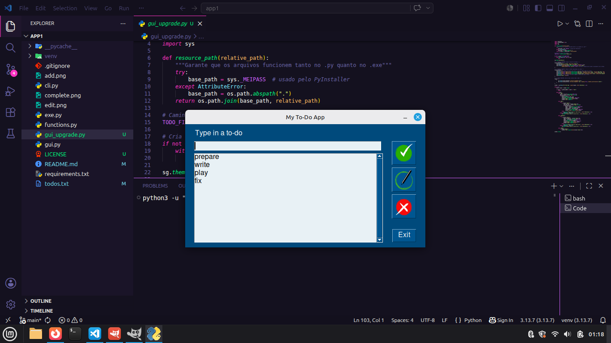

# 📝 MyTodolist App — Gerenciador de Tarefas Desktop


> Aplicação desktop para gerenciamento de tarefas desenvolvida em **Python** com **FreeSimpleGUI**.  
> O aplicativo permite adicionar, editar e remover tarefas com salvamento automático em arquivo externo.

---

## 📷 Preview

<p align="center">
  
</p>

---

## 🧠 Sobre o projeto

O **MyTodolist App** foi criado para oferecer uma experiência prática e objetiva na organização de tarefas do dia a dia.

Com ele, o usuário pode:

- ➕ **Adicionar** novas tarefas  
- ✏️ **Editar** tarefas existentes  
- 🗑️ **Excluir** tarefas concluídas ou desnecessárias  

Todas as alterações são salvas automaticamente no arquivo `todos.txt`, garantindo persistência dos dados entre execuções.

---

## 🧩 Estrutura do projeto

```text
mytodolist-app/
├── gui.py             # Interface (FreeSimpleGUI)
├── gui_upgrade.py     # Interface (FSG) (com melhoria no layout)
├── functions.py       # Manipulação de dados e persistência
├── cli.py             # Lógica backend da aplicação
├── exe.py             # Configuração do executável
├── add.png            # Ícone do botão "Adicionar"
├── edit.png           # Ícone do botão "Editar"
├── complete.png       # Ícone do botão "Excluir"
├── todos.txt          # Arquivo com as tarefas salvas
├── preview.png        # Imagem da aplicação aberta
├── requirements.txt   # Dependências Python
├── LICENSE            # Licença MIT
└── README.md          # Documentação do projeto
```

---

## ⚙️ Instalação e execução

1. **Clone o repositório**
   ```bash
   git clone https://github.com/danilo-santos-python/mytodolist-app.git
   cd mytodolist-app
   ```

2. **Crie um ambiente virtual**
   ```bash
   python -m venv venv
   ```

3. **Ative o ambiente virtual**

   **Windows**
   ```bash
   venv\Scripts\activate
   ```

   **Linux/macOS**
   ```bash
   source venv/bin/activate
   ```

4. **Instale as dependências**
   ```bash
   pip install -r requirements.txt
   ```

5. **Execute o aplicativo**
   ```bash
   python gui.py
   ```

---

## 🛠️ Tecnologias utilizadas

- **Manipulação de dados e persistência**

---

## 🚧 Status do projeto

> 🟡 Aplicativo em desenvolvimento.  
> Novos recursos e melhorias visuais serão adicionados em futuras versões.

---

## 📜 Licença

Distribuído sob a **Licença MIT**.

Este projeto é open source e pode ser utilizado livremente para fins educacionais e de aprendizado.

---

## 👨‍💻 Autor

**Danilo Santos**  
🐙 GitHub: https://github.com/danilo-santos-python  
🌐 Repositório: https://github.com/danilo-santos-python/mytodolist-app

---

⭐ Se este projeto foi útil para você, deixe uma estrela no repositório.
